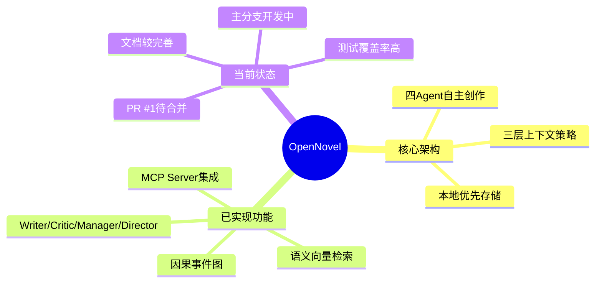

#

根据对 **OpenNovel** 项目的代码库、Pull Request 和开发日志的深入分析。

## 📊 项目现状概览

## 🔍 主要缺陷与优化方向

### 一、架构与设计层面

#### 1. **Agent协作复杂性与可维护性**

* **缺陷**：四Agent系统（Writer、Critic、Manager、Director）虽然功能强大，但协作逻辑复杂，状态同步和错误传播路径不透明。
* **优化方向**：
  * 引入 **事件溯源（Event Sourcing）** 模式，所有Agent操作记录为不可变事件流，便于调试和回滚。
  * 实现 **Agent状态可视化仪表盘**，实时展示各Agent的输入、输出、内部状态及依赖关系。
  * 增加Agent间的 **显式通信协议**，而非通过共享状态隐式协作，提高可维护性。

#### 2. **三层上下文策略的实用性**

* **缺陷**：当前实现了FRUGAL/STANDARD/PANORAMIC三级上下文策略，但策略选择缺乏自适应机制，依赖用户手动选择。
* **优化方向**：
  * 实现 **自动策略选择**：基于章节复杂度、角色数量、历史Token消耗等指标自动推荐上下文策略。
  * 引入 **动态预算调整**：根据实时Token消耗和剩余预算，动态调整各部分上下文的注入比例。

### 二、模型与生成质量

#### 1. **模型路由策略的细化**

* **缺陷**：当前支持不同阶段使用不同模型，但模型选择逻辑较为简单，缺乏基于内容类型的自适应路由。
* **优化方向**：
  * 引入 **模型性能监控**：记录不同模型在各章节上的评分、Token消耗、生成时间，为模型选择提供数据支持。

#### 2. **生成质量控制**

* **缺陷**：Critic的五维评分（文笔、情节、角色、节奏、情感）缺乏校准，不同评分维度可能存在系统性偏差。
* **优化方向**：
  * 引入 **评分校准机制**：使用已知质量的人类作品作为基准，校准Critic的评分系统。
  * 实现 **多Critic投票机制**：重要章节使用多个Critic实例并行评分，减少单一LLM的偏见。

### 三、用户体验与可用性

#### 1. **学习曲线与上手难度**

* **缺陷**：项目强调“本地优先”、“Markdown写作”，但对普通小说作者而言，CLI操作和YAML配置存在一定门槛。
* **优化方向**：
  * 开发 **桌面GUI客户端**：提供可视化界面，降低CLI使用门槛，同时保持本地优先特性。
  * 实现 **交互式教程向导**：集成在CLI中，通过实际项目引导用户逐步掌握核心功能。

#### 2. **创作反馈与干预机制**

* **缺陷**：当前“AI提议，人类批准”的模式较为机械，缺乏细粒度的创作干预方式。
* **优化方向**：
  * 实现 **选择性接受**：允许用户接受/拒绝AI建议的特定部分，而非整体接受或拒绝。
  * 引入 **创作约束编辑器**：允许用户动态调整创作约束（如文风、人物关系、情节走向），AI在约束下生成。

### 四、技术实现与性能

#### 1. **本地资源的消耗与优化**

* **缺陷**：向量检索和因果图计算对本地资源要求较高，可能影响在普通电脑上的运行体验。
* **优化方向**：
  * 实现 **资源感知降级**：检测系统资源状况，自动调整计算强度（如降低向量索引精度、简化因果图计算）。
  * 引入 **后台计算模式**：将重型计算任务（如向量索引构建）放在后台异步执行，不阻塞用户创作。

#### 2. **错误处理与恢复**

* **缺陷**：当前系统通过快照实现回滚，但对生成过程中的部分失败（如某Agent超时）处理不够细化。
* **优化方向**：
  * 实现 **检查点恢复**：在关键生成阶段保存检查点，失败后可以从最近检查点继续，而非完全重新开始。
  * 引入 **故障分析报告**：自动生成故障报告，包含错误上下文、可能原因、建议解决方案。

### 五、内容一致性与世界观维护

#### 1. **长期一致性的保持**

* **缺陷**：随着章节增加，角色状态、事件因果的一致性维护难度呈指数增长，当前因果图可能难以应对超长篇小说（百万字级别）。
* **优化方向**：
  * 引入 **分层因果图**：在全局因果图之下，为每个角色弧线、情节线建立子因果图，降低复杂度。
  * 实现 **一致性审计模式**：定期自动检查角色状态、事件因果的一致性，主动提示潜在矛盾。

#### 2. **世界观规则的灵活性**

* **缺陷**：当前世界观规则检查（Canon Integrity Checking）基于规则验证，可能缺乏对“打破常规”文学手法的支持。
* **优化方向**：
  * 引入 **规则豁免机制**：允许作者在特定场景下临时豁免某些世界观规则，支持“打破常规”的文学创作。
  * 实现 **规则解释与建议**：当检测到规则违反时，不仅报错，还提供修改建议或文学上的合理化建议。

## 🎯 优化优先级建议

| **优先级** | **优化方向**      | **预期收益**         | **实施难度** |
| ------- | ------------- | ---------------- | -------- |
| **P0**  | 桌面GUI客户端开发    | 大幅降低使用门槛，扩大用户群   | 高        |
| **P1**  | 内容感知模型路由      | 提升生成质量，降低成本      | 中        |
| **P1**  | 自动策略选择与动态预算调整 | 优化Token消耗，提高生成效率 | 中        |
| **P2**  | 分层因果图与一致性审计   | 支持超长篇创作，保证质量     | 高        |
| **P2**  | 交互式教程与模板库     | 加速新手学习，提高留存      | 中        |
| **P3**  | 模型性能监控与评分校准   | 提高生成质量稳定性        | 中        |
| ​       | ​             | ​                | ​        |

## 💡 创新性优化思路

1. **“写作伴侣”模式**：开发一个始终在线的AI伴侣，实时提供写作建议、灵感补充、一致性检查，而非只在特定阶段介入。
2. **“多线叙事”支持**：专门优化多线叙事结构，自动管理不同故事线的时间线、角色交叉和汇合点。

## 📈 总结

OpenNovel项目在技术架构上已经相当完善，特别是在多Agent协作、本地优先存储、语义检索等方面有创新性设计。其主要缺陷集中在**可用性**、**长期一致性维护**方面。通过优先解决GUI客户端、模型路由优化和一致性审计等问题，项目可以显著提升用户体验和生成质量，有望成为专业级长篇小说创作工具。
